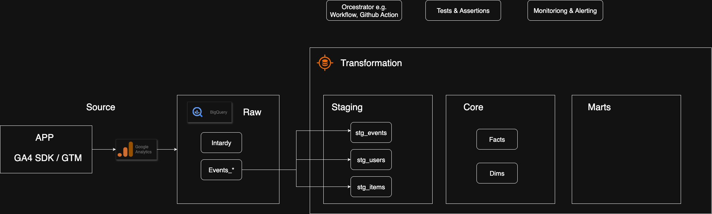

# GA4 Data Warehouse

A production-ready dbt project for transforming Google Analytics 4 (GA4) BigQuery export data into analytics-ready dimensional models. This project implements a modern data warehouse architecture following the Kimball methodology with fact and dimension tables optimized for business intelligence and reporting.

## 📋 Table of Contents

- [Overview](#overview)
- [Architecture](#architecture)
- [Prerequisites](#prerequisites)
- [Installation](#installation)
- [Project Structure](#project-structure)
- [Data Models](#data-models)
- [Configuration](#configuration)
- [Usage](#usage)
- [Testing](#testing)
- [Contributing](#contributing)

## 🎯 Overview

This dbt project transforms raw GA4 BigQuery export data into a structured analytical data warehouse. It provides:

- **Staging Layer**: Clean, typed, and deduplicated GA4 event data
- **Core Layer**: Dimensional model with fact and dimension tables
- **Marts Layer**: Business-specific data marts for different teams
- **Incremental Processing**: Efficient processing of daily GA4 data exports
- **Data Quality**: Comprehensive testing and documentation


### Key Features

- ✅ Handles GA4's complex nested event structure
- ✅ Incremental loading with configurable lookback windows
- ✅ Partitioned and clustered tables for optimal BigQuery performance
- ✅ Reusable macros for common GA4 transformations
- ✅ Support for e-commerce and standard GA4 events
- ✅ Dimensional modeling following Kimball methodology

## 🏗️ Architecture

### High level Flow 



### Data Flow

1. **Source**: Raw GA4 BigQuery export tables (`events_*`)
2. **Staging**: Cleaned and typed data with consistent naming
3. **Core**: Fact and dimension tables (star schema)
4. **Marts**: Department-specific aggregated views

## 📦 Prerequisites

- **dbt Core** >= 1.5.0 or **dbt Cloud**
- **BigQuery** project with GA4 data export enabled
- **Python** >= 3.8 (for dbt Core)
- **Google Cloud SDK** (for local development)

## 🚀 Installation

### 1. Clone the Repository

```bash
git clone https://github.com/your-org/ga4-warehouse.git
cd ga4-warehouse
```

### 2. Install dbt Dependencies

```bash
pip install dbt-bigquery
dbt deps  # Installs dbt packages (e.g., dbt-utils)
```

### 3. Configure BigQuery Connection

Create a `profiles.yml` in your `~/.dbt/` directory:

```yaml
ga4_warehouse:
  target: dev
  outputs:
    dev:
      type: bigquery
      method: service-account
      project: your-gcp-project-id
      dataset: ga4_dev
      threads: 4
      keyfile: /path/to/service-account-key.json
      location: US
    prod:
      type: bigquery
      method: service-account
      project: your-gcp-project-id
      dataset: ga4_prod
      threads: 8
      keyfile: /path/to/service-account-key.json
      location: US
```

### 4. Update Project Variables

Edit `dbt_project.yml` to configure your GA4 source:

```yaml
vars:
  ga4_export_dataset: 'analytics_123456789'  # Your GA4 export dataset
  ga4_project: 'your-gcp-project'           # Your GCP project
  ga4_start_date: '2023-01-01'              # Earliest date to process
```

## 📁 Project Structure

```
ga4_warehouse/
├── analyses/               # Ad-hoc analysis queries
├── macros/                 # Reusable SQL functions
│   ├── ga4_param.sql      # GA4 parameter extraction
│   ├── ga4_unnest_params.sql
│   ├── channel_group_expr.sql
│   ├── generate_event_key.sql
│   ├── timestamp_utils.sql
│   └── url_normalize.sql
├── models/
│   ├── source/            # Source table definitions
│   │   └── sources.yml
│   ├── staging/           # Staging transformations
│   │   └── ga4/
│   │       ├── stg_ga4_events.sql
│   │       ├── stg_ga4_items.sql
│   │       └── stg_ga4_users.sql
│   ├── core/              # Core dimensional model
│   │   └── ga4/
│   │       ├── dim_date.sql
│   │       ├── dim_device.sql
│   │       ├── dim_geo.sql
│   │       ├── dim_items.sql
│   │       ├── dim_page.sql
│   │       ├── dim_traffic.sql
│   │       ├── dim_user.sql
│   │       ├── fact_event.sql
│   │       ├── fact_order.sql
│   │       ├── fact_order_item.sql
│   │       ├── fact_pageview.sql
│   │       └── fact_sessions.sql
│   └── marts/             # Business-specific data marts
│       ├── core/
│       ├── marketing/
│       └── product/
├── seeds/                 # Static reference data
├── snapshots/             # SCD Type 2 history tracking
├── tests/                 # Custom data tests
├── dbt_project.yml        # Project configuration
└── packages.yml           # External package dependencies
```

## 📊 Data Models

### Staging Layer (`models/staging/`)

| Model | Description | Update Frequency |
|-------|-------------|------------------|
| `stg_ga4_events` | Cleaned and typed GA4 events | Incremental (daily) |
| `stg_ga4_items` | E-commerce item details | Incremental (daily) |
| `stg_ga4_users` | User-level aggregations | Incremental (daily) |

### Core Layer (`models/core/`)

#### Dimension Tables

| Model | Description | Primary Key |
|-------|-------------|-------------|
| `dim_date` | Date dimension with calendar attributes | `date_key` |
| `dim_device` | Device and browser information | `device_key` |
| `dim_geo` | Geographic location hierarchy | `geo_key` |
| `dim_items` | Product/item master data | `item_id` |
| `dim_page` | Page and screen information | `page_key` |
| `dim_traffic` | Traffic source and campaign data | `traffic_key` |
| `dim_user` | User attributes and segments | `user_id` |

#### Fact Tables

| Model | Description | Grain | Update Frequency |
|-------|-------------|-------|------------------|
| `fact_event` | All GA4 events | One row per event | Incremental |
| `fact_pageview` | Page view events | One row per pageview | Incremental |
| `fact_sessions` | Session-level metrics | One row per session | Incremental |
| `fact_order` | E-commerce transactions | One row per order | Incremental |
| `fact_order_item` | Transaction line items | One row per item | Incremental |

### Marts Layer (`models/marts/`)

Business-specific aggregations and KPIs for:
- **Core**: Cross-functional metrics and KPIs
- **Marketing**: Campaign performance, attribution, user acquisition
- **Product**: Product analytics, user behavior, feature adoption

## ⚙️ Configuration

### Key Variables (`dbt_project.yml`)

```yaml
vars:
  # GA4 Source Configuration
  ga4_export_dataset: 'analytics_123456789'
  ga4_project: 'your-project-id'
  
  # Processing Configuration
  ga4_start_date: '2023-01-01'
  ga4_incremental_lookback_days: 7
  
  # Event Filtering
  excluded_events: ['session_start', 'first_visit', 'scroll']
  
  # Data Quality
  test_severity_threshold: 'warn'
  max_stale_hours: 24
```

### BigQuery Optimization

Models are configured with:
- **Partitioning**: Daily partitions on event_date for efficient querying
- **Clustering**: On common filter columns (user_pseudo_id, event_name)
- **Incremental Strategy**: Merge for fact tables, insert_overwrite for events

## 🔧 Usage

### Running the Project

```bash
# Run all models
dbt run

# Run specific models
dbt run --select staging.ga4.*
dbt run --select +fact_sessions  # Run model and its dependencies

# Full refresh (rebuild all incremental models)
dbt run --full-refresh

# Run tests
dbt test

# Generate documentation
dbt docs generate
dbt docs serve
```

### Common Workflows

#### Daily Processing
```bash
# Process yesterday's data
dbt run --select tag:incremental
dbt test --select tag:incremental
```

#### Backfill Historical Data
```bash
# Full refresh for specific date range
dbt run --full-refresh --vars '{ga4_start_date: 2023-01-01}'
```

#### Development Workflow
```bash
# Run in dev environment with limited data
dbt run --target dev --select +my_model
dbt test --target dev --select my_model
```

## 🧪 Testing

### Built-in Tests

- **Schema Tests**: Defined in `_models.yml` files
  - Unique constraints
  - Not null checks
  - Referential integrity
  - Accepted values

- **Custom Tests**: Located in `tests/` directory
  - Data freshness checks
  - Business rule validations
  - Anomaly detection

### Running Tests

```bash
# Run all tests
dbt test

# Run tests for specific models
dbt test --select fact_sessions

# Run tests by severity
dbt test --severity error
```

## 🤝 Contributing

We welcome contributions! Please follow these guidelines:

1. Fork the repository
2. Create a feature branch (`git checkout -b feature/amazing-feature`)
3. Make your changes following our style guide:
   - Use lowercase for model names
   - Prefix staging models with `stg_`
   - Prefix dimension tables with `dim_`
   - Prefix fact tables with `fact_`
4. Add tests for new models
5. Update documentation
6. Submit a pull request

### Development Setup

```bash
# Install pre-commit hooks
pip install pre-commit
pre-commit install

# Run linting
sqlfluff lint models/
sqlfluff fix models/
```


## 📄 License

This project is licensed under the MIT License - see the [LICENSE](LICENSE) file for details.

---

**Maintained by**: Your Data Team  
**Last Updated**: 2025-08-15  
**Version**: 1.0.0